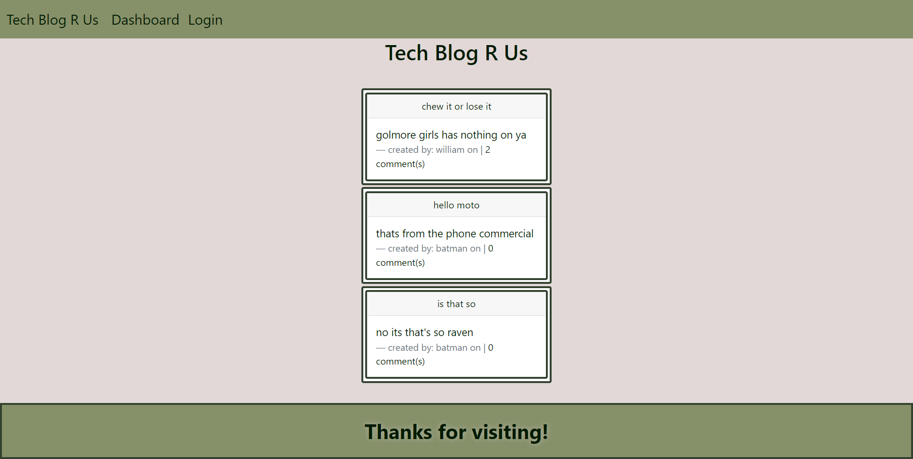

# Tech Blog
  
 
 ## Description
 
 Become a user and post about your tech! comment on other peoples posts and be a part of the community.
  

 ## Table of Contents
 * [Installation](#Installation)
 * [Usage](#Usage)
 * [Contributing](#Contributing)
 * [Tests](#Tests)
 * [Questions](#Questions)
 
 ## Installation
 go to the deployed site here: https://morning-scrubland-20709.herokuapp.com/
 or download the repository and run the cript so that the database is created. you will need mySql and node.js to have this file run.

 ## Usage
 Click on the new user link and fill out the form to become a new user. then post to your desire. Edit or even delete your posts. 
 
 ## Contributing
 N/A

 ## Tests
 N/A

 ## Questions
 here is the link to my Github: [github.com/maks-pixel](github.com/maks-pixel)
 If you have any questions regarding the project or anything else you can contact me at:
 
  Email: [maksgirmay@gmail.com](maksgirmay@gmail.com) 
